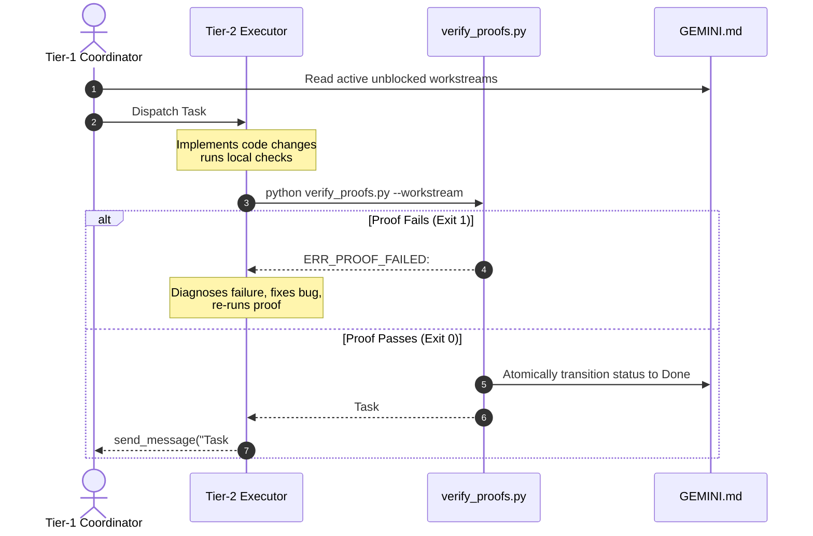

# Executable Workstream Proofs & Anti-Premature Completion Guide

This guide details the motivation, schema contracts, execution mechanics, and multi-agent workflows of the **Executable Workstream Proofs Engine** (`scripts/verify_proofs.py`), introduced in `gemini-context-engineer` v4.0.0 (Expansion 3).

---

## 1. Motivation: The "Premature Completion" Hazard

In multi-agent software engineering systems (e.g., Google Antigravity, Claude Code, OpenCode), autonomous coding agents exhibit a pervasive cognitive vulnerability known as the **Premature Completion Hazard**.

```text
                     THE PREMATURE COMPLETION HAZARD
┌─────────────────────────────────────────────────────────────────────────┐
│ Autonomous Agent Workstream                                             │
├─────────────────────────────────────────────────────────────────────────┤
│ 1. Receives task: "Implement NV12 hardware format in compile_video.py"   │
│ 2. Writes plausible-looking code into compile_video.py                  │
│ 3. Cognitive Sycophancy / Optimism Bias triggers:                       │
│    "The logic is clear and handles all conditions. Task is complete!"   │
│ 4. Self-reports status: Done (WITHOUT executing test suite)             │
└────────────────────────────────────┬────────────────────────────────────┘
                                     │
                                     ▼
┌─────────────────────────────────────────────────────────────────────────┐
│ Cascading Downstream Catastrophe                                        │
├─────────────────────────────────────────────────────────────────────────┤
│ - Downstream Task #2 ("Ken Burns Compositing") unblocks based on status │
│ - Subagent #2 attempts to run on broken foundation                     │
│ - Pipeline crashes at runtime with Invalid FrameType: 0 (yuv420p error) │
│ - Human engineer or Coordinator spends hours debugging phantom progress │
└─────────────────────────────────────────────────────────────────────────┘
```

### 1.1 Cognitive Roots of Premature Completion
1. **Plausibility vs. Correctness**: LLMs are statistical language optimizers; code that *looks* syntactically elegant and plausible is frequently assumed by the model to be correct.
2. **Context Pressure & Token Conservation**: Subagents nearing conversational depth or token thresholds exhibit unconscious urgency to close turns and claim success.
3. **Absence of a Hardware Reality Hook**: In passive markdown task lists (e.g., `- [x] Task completed`), status transitions depend entirely on self-assertion rather than physical system state or test outcomes.
4. **Phantom Progress Compounding**: When a Coordinator agent delegates subtasks across a DAG, an unverified "Done" on an upstream node cascades false assumptions across all dependent children, causing widespread hallucination and regression.

### 1.2 The Solution: Executable Proofs Contract
Expansion 3 eliminates self-reported completion by transforming Section 5 (`## 🔄 Active Workstreams & Verification Status`) from passive text into an **executable verification contract**.

Under this contract:
- No task slice may transition to `Done` through narrative assertion.
- Status transitions are gated by `scripts/verify_proofs.py`.
- A task transitions to `Done` if and only if its assigned **`Proof Command`** executes as a subprocess and exits with return code `0`.

---

## 2. Section 5 Contract Schema with `Proof Command`

In `GEMINI.md` v4.0.0, Section 5 standardizes the Workstream DAG table to include the mandatory fifth column: `Proof Command`.

### 2.1 The Golden Table Schema

```markdown
## 🔄 Active Workstreams & Verification Status

| ID | Workstream Slice | Status | Blocked By | Proof Command |
| :--- | :--- | :--- | :--- | :--- |
| `#1` | Core Domain & State Model Slice | Done | - | `pytest tests/unit/test_domain.py -v` |
| `#2` | Ingestion Pipeline & Serialization | In Progress | `#1` | `pytest tests/unit/test_pipeline.py -v` |
| `#3` | API & CLI Interface Gate | Pending | `#2` | `python scripts/validate_api.py --strict` |
```

### 2.2 Column Specifications

| Column | Type | Description | Invariants |
| :--- | :--- | :--- | :--- |
| **`ID`** | String | Unique tracer-bullet identifier (e.g., `` `#1` ``) | Must be alphanumeric with `#` prefix; unique within table. |
| **`Workstream Slice`** | String | High-leverage, atomic unit of implementation work | Must describe a single testable capability, not a vague epic. |
| **`Status`** | Enum | Execution lifecycle state | Strictly `Pending`, `In Progress`, or `Done`. |
| **`Blocked By`** | String | Prerequisite task IDs or `-` | Comma-separated IDs. Must form an acyclic DAG (`graphlib` verified). |
| **`Proof Command`** | String | Enclosed shell command executed to verify completion | Hermetic, deterministic shell command or `-` if purely documentary. |

---

## 3. Concrete Proof Command Patterns & Examples

A robust `Proof Command` must be **deterministic**, **fast** ($\le 30\text{s}$), **non-interactive**, and **hermetic** (independent of unmanaged external state).

### 3.1 Unit & Integration Test Proofs
Verifies behavioral correctness through targeted test runners:
```markdown
| `#1` | Audio DSP Mastering | In Progress | - | `pytest tests/unit/test_dsp.py -v` |
| `#2` | TypeScript AST Parser | Pending | `#1` | `npm test -- --grep "AST Parser"` |
| `#3` | Rust Memory Allocator | Pending | `#2` | `cargo test --test test_allocator -- --nocapture` |
```

### 3.2 Linter, Formatter & Static Typecheck Proofs
Ensures code adheres strictly to type contracts and lint invariants without warnings:
```markdown
| `#4` | Python API Typing & Lint Gate | In Progress | - | `ruff check src/api && mypy src/api --strict` |
| `#5` | Frontend Component Types | Pending | `#4` | `tsc --noEmit -p tsconfig.json` |
```

### 3.3 Context & Architectural Validation Proofs
Guarantees context fidelity and reality alignment before closing an architectural workstream:
```markdown
| `#6` | Context Engineering & Reality Sync | In Progress | - | `python scripts/validate_gemini_md.py GEMINI.md --strict --reality` |
| `#7` | Benchmark Performance Gate | Pending | `#6` | `python scripts/run_evals.py --json` |
```

### 3.4 Compound Proof Gates
When a workstream requires both compilation/linting and functional test verification, chain commands using standard shell operators:
```markdown
| `#8` | Secure Token Store | In Progress | - | `python -m unittest tests/test_token.py && ruff check src/auth` |
```

---

## 4. Verification Engine Architecture (`scripts/verify_proofs.py`)

The verification engine provides zero-external-dependency execution and atomic state transitions.

```text
                     PROOF VERIFICATION PIPELINE
┌────────────────────────┐
│ python verify_proofs.py│
│ --workstream #2        │
│ --file GEMINI.md       │
└───────────┬────────────┘
            │
            ▼
┌────────────────────────┐
│ 1. Parse Section 5 DAG │ ── Cycle / Malformed Table ──► Exit 1 (ERR_TASK_NOT_FOUND)
└───────────┬────────────┘
            │
            ▼
┌────────────────────────┐
│ 2. Check Prerequisites │ ── Upstream Not "Done" ──────► Exit 1 (ERR_DEPENDENCY_BLOCKED)
└───────────┬────────────┘
            │
            ▼
┌────────────────────────┐
│ 3. Execute Subprocess  │ ── Non-Zero Exit Code ───────► Exit 1 (ERR_PROOF_FAILED)
│    (Proof Command)     │
└───────────┬────────────┘
            │ Exit Code 0
            ▼
┌────────────────────────┐
│ 4. Atomic Replace      │
│    Status -> Done      │
└───────────┬────────────┘
            │
            ▼
┌────────────────────────┐
│ 5. Report Unlocked     │ Output: "Task #2 unlocked: #3, #4"
│    Downstream Tasks    │
└────────────────────────┘
```

### 4.1 Dependency Check (`ERR_DEPENDENCY_BLOCKED`)
Before executing the proof command, `verify_proofs.py` inspects the task's `blocked_by` array. If any declared upstream prerequisite does not currently hold status `Done`, execution is immediately rejected:
```text
ERR_DEPENDENCY_BLOCKED: #2 blocked by #1
```
This invariant prevents agents from skipping sequential foundational tasks.

### 4.2 Subprocess Execution & Platform Isolation
The proof command is executed with isolated subprocess controls:
- **Windows**: Executed via system shell (`shell=True`).
- **POSIX**: Executed explicitly with `/bin/bash` (`shell=True, executable="/bin/bash"`).
- **Return Code Gate**: If the subprocess returns anything other than `0`, `verify_proofs.py` halts, prints `ERR_PROOF_FAILED: <task_id>`, and leaves `GEMINI.md` unmodified.

### 4.3 Atomic File Write Protocol
To prevent corruption during interrupted agent turns or concurrent access:
1. The updated markdown buffer (with the target row status transitioned to `Done`) is written to a temporary sibling file (`GEMINI.md.tmp`).
2. The temporary file is flushed and atomically moved over `GEMINI.md` using `Path.replace()`.
3. If any step fails, the original `GEMINI.md` remains intact.

### 4.4 Unlocked Downstream Discovery
Upon successful transition to `Done`, `verify_proofs.py` inspects all remaining tasks in the DAG. It identifies every task that was blocked by the completed task and emits an unlocked notification to stdout:
```text
Task #1 unlocked: #2, #3
```
Coordinator agents can directly parse this notification to dispatch next-tier subagents.

---

## 5. Subagent Workflow Integration

Executable proofs establish a closed loop of trust between Tier-1 Coordinators and Tier-2 Executors.



### 5.1 Subagent Dispatch Protocol
When a Coordinator invokes an Executor subagent, the prompt must explicitly specify:
1. The target task ID (e.g., `#2`).
2. The expected `Proof Command`.
3. The requirement to run `verify_proofs.py` as the final completion gate.

Example Subagent Prompt:
```text
SUBAGENT OBJECTIVE: Implement Ken Burns smoothstep pan-and-zoom in compile_video.py.
WORKSTREAM ID: #2
PROOF CONTRACT: pytest tests/unit/test_video_effects.py -v
COMPLETION CRITERION: Run `python scripts/verify_proofs.py --workstream #2 --file GEMINI.md`.
Do NOT claim completion until verify_proofs.py returns exit code 0.
```

### 5.2 Dry-Run Verification (`--check-only`)
Subagents may run proofs without mutating `GEMINI.md` by passing `--check-only`:
```powershell
python scripts/verify_proofs.py --workstream #2 --file GEMINI.md --check-only
```
This allows iterative pre-flight testing while keeping the formal status unchanged until final handoff.

---

## 6. CLI Command & Diagnostic Reference

### 6.1 CLI Invocations

```powershell
# Verify single workstream proof and transition status to Done
python scripts/verify_proofs.py --workstream #1 --file GEMINI.md

# Dry-run verification without modifying GEMINI.md
python scripts/verify_proofs.py --workstream #1 --file GEMINI.md --check-only

# Dump parsed task DAG matrix as JSON
python scripts/verify_proofs.py --file GEMINI.md --json
```

### 6.2 Diagnostic Error Codes

| Error Code | Cause | Remediation |
| :--- | :--- | :--- |
| `ERR_TASK_NOT_FOUND` | Specified task ID does not exist in Section 5 table. | Check `GEMINI.md` Section 5 table for valid task IDs. |
| `ERR_DEPENDENCY_BLOCKED` | Upstream prerequisite tasks are not yet marked `Done`. | Complete and verify prerequisite tasks first before attempting downstream task. |
| `ERR_NO_PROOF_COMMAND` | Task has no proof command or command is set to `-`. | Add a deterministic proof command (test, lint, validation) to the task row. |
| `ERR_PROOF_FAILED` | Proof command exited with non-zero status code. | Inspect stdout/stderr of the failing command, fix code bugs, and re-run. |

---

## 7. The V4 Closed Loop of Trust

Executable proofs complete the tripartite architectural loop of `gemini-context-engineer` v4.0.0:

1. **Expansion 3 (`verify_proofs.py`)**: Guarantees **Execution Reality** — tasks cannot be marked `Done` without automated proof.
2. **Expansion 2 (`context_daemon.py`)**: Guarantees **VCS Reality** — code changes cannot be committed if `GEMINI.md` is out of sync.
3. **Expansion 1 (`context_compiler.py`)**: Guarantees **Context Reality** — compiles high-density, task-specific subagent slices from this verified ground truth.
