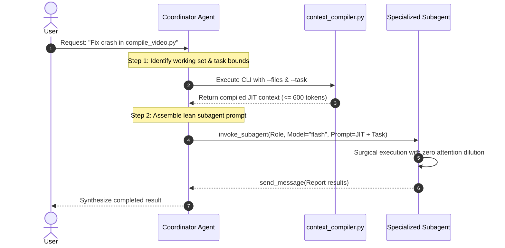

# JIT Context Compiler & Projection Engine Guide

This guide details the architecture, motivation, algorithmic foundations, and operational protocols of the **Just-In-Time (JIT) Context Compiler** (`scripts/context_compiler.py`), introduced in `gemini-context-engineer` v4.0.0.

---

## 1. Motivation: The Monolithic Context Pathology

In modern multi-agent systems and high-throughput coding workflows, agents often rely on a centralized workspace context file (`GEMINI.md`). While an authoritative, 5-tier `GEMINI.md` is essential as a global Single Source of Truth (SSOT), naively feeding the entire monolithic document into every subagent prompt introduces three critical failure modes:

### 1.1 Attention Dilution & Cognitive Distraction
Large language models (LLMs) operate with finite effective attention. When a subagent tasked with a narrow objective (e.g., *"Fix the NV12 hardware pixel format crash in `compile_video.py`"*) is inundated with 2,500 to 3,500 tokens of global context—including audio DSP filters, Faster-Whisper pause-splitting thresholds, and persona dialect lexicons—its attention mechanism is diluted across irrelevant tokens. This "needle-in-a-haystack" degradation increases the probability of:
- Hallucinating cross-subsystem imports.
- Applying contradictory guidelines meant for unrelated modules.
- Failing to prioritize the single critical constraint governing the target file.

### 1.2 Subagent Blast-Radius Bleed
Subagents dispatched without strict bounded context frequently overstep their mandate. A subagent working on video rendering that sees audio mastering workflows may attempt unrequested edits to `automate_audacity.py` or refactor shared configuration files outside its scope, violating the **Surgical Changes Only** non-negotiable.

### 1.3 Compounding Token Costs & Latency
In complex orchestrations where a Tier-1 Coordinator dispatches 5 to 10 parallel subagents (each running multi-turn loops), injecting 3,000 tokens of monolithic context per turn burns hundreds of thousands of redundant tokens:

$$\text{Wasted Tokens} = N_{\text{subagents}} \times M_{\text{turns}} \times (\text{Tokens}_{\text{monolithic}} - \text{Tokens}_{\text{JIT}})$$

For 8 subagents averaging 6 turns:
$$8 \times 6 \times (3,000 - 550) = 117,600 \text{ wasted prompt tokens}$$

JIT context projection eliminates ~80% of prompt token volume per subagent turn while simultaneously accelerating time-to-first-token (TTFT) and sharpening reasoning fidelity.

---

## 2. Minimal Invariant Projection (MIP)

The JIT Context Compiler is powered by the concept of **Minimal Invariant Projection (MIP)**:

> **Definition (Minimal Invariant Projection)**:
> Given a repository with authoritative context $\mathcal{C}$, a target working set of files $\mathcal{F} = \{f_1, f_2, \dots, f_k\}$, and a task prompt $\mathcal{T}$, the Minimal Invariant Projection $\mathcal{P}(\mathcal{C}, \mathcal{F}, \mathcal{T})$ is the mathematical minimum subset of non-inferable architectural invariants, dependency interfaces, and ubiquitous domain terms required to guarantee zero invariant violations while strictly bounded to a token budget $\mathcal{B} \le 600$.

```text
┌──────────────────────────────────────────────────────────────┐
│                  Authoritative GEMINI.md                     │
│                  (~2,500 - 3,500 tokens)                     │
└──────────────────────────────┬───────────────────────────────┘
                               │
               ┌───────────────┴───────────────┐
               │  AST Dependency Closure       │
               │  + Task Lexicon Intersect     │
               └───────────────┬───────────────┘
                               ▼
┌──────────────────────────────────────────────────────────────┐
│          Minimal Invariant Projection (MIP) Slice            │
│  - Universal Cognitive Non-Negotiables                       │
│  - Filtered Subsystem Invariants (Target Domain Only)         │
│  - AST 1-Hop / 2-Hop Component Mapping Table                 │
│  - Active Task Blockers & Proof Commands                     │
│                  (Clamped: <= 600 tokens)                    │
└──────────────────────────────────────────────────────────────┘
```

### 2.1 The Four Invariance Axioms of MIP

1. **Axiom of Universal Invariants (Preservation)**: Universal cognitive rules (Anti-Sycophancy, Surgical Changes Only, Plausibility Is Not Correctness) and foundational security invariants are invariant under all projections and can **never** be pruned.
2. **Axiom of Topological Containment (Closure)**: If a component $A$ directly imports or calls component $B$ ($A \rightarrow B$), both $A$ and $B$ must appear in the projected architectural mapping if either is in the target working set.
3. **Axiom of Domain Intersection (Relevance)**: A domain invariant or lexicon term is included if and only if its keywords intersect with the AST symbol table (function names, class names, imports) or the task prompt text.
4. **Axiom of Deterministic Budgeting (Clamping)**: The total size of the projection must strictly obey $\text{tokens}(\mathcal{P}) \le \mathcal{B}$ (default 600 tokens).

---

## 3. Slicing Mechanics & AST Dependency Closure

`context_compiler.py` executes a 4-stage pipeline using Python's standard library `ast`:

```text
Target Files ──► [1. AST Visitor] ──► Dependency Subgraph ──┐
                                                            ▼
GEMINI.md    ──► [2. Parser]      ──► 5-Tier AST Node Map ──► [3. Slicer] ──► [4. Budget Clamper] ──► JIT Context
```

### Stage 1: AST Dependency Harvesting
For each target file, `context_compiler.py` uses `ast.NodeVisitor` to harvest:
- **`ast.Import` & `ast.ImportFrom`**: Resolves local module imports across the repository root (e.g., `import timeline_engine` $\rightarrow$ `timeline_engine.py`).
- **`ast.ClassDef` & `ast.FunctionDef`**: Extracts public API symbols.
- **`ast.Call`**: Traces call graphs to discover immediate 1-hop and 2-hop dependencies.
- **Resilient Fallback**: If a target file contains in-flight syntax errors, the parser falls back to regex-based symbol and import extraction without crashing.

### Stage 2: 5-Tier Semantic Slicing
The compiler matches the dependency closure against the canonical sections of `GEMINI.md`:
- **Section 1 (Overview)**: Stripped or condensed to a 1-sentence micro-summary.
- **Section 2 (Architecture)**: Retains only table rows corresponding to files in the dependency closure.
- **Section 2 (Domain Lexicon)**: Retains only entries whose terms appear in the task description or harvested AST symbols.
- **Section 3 (Mandatory Constraints)**: Injects the permanent cognitive non-negotiables, plus any rule whose keywords match the target domain (e.g., QSV, NV12, CDP, Timeline).
- **Section 4 (Workflows & CLI)**: Filters commands down to the runtime relevant to the target files (e.g., Python `pytest` commands for `.py` targets).
- **Section 5 (Workstreams)**: Filters out completed tasks; includes only the active slice and its immediate dependencies.

### Stage 3: Progressive Priority Clamping
If the projected slice exceeds the token budget $\mathcal{B}$ (calculated via `len(text) // 4`), the compiler executes prioritized shedding:
1. **Drop Phase 1**: Prune Section 5 workstream notes.
2. **Drop Phase 2**: Prune secondary CLI workflow commands.
3. **Drop Phase 3**: Prune 2-hop architectural dependencies (retaining direct 1-hop files).
4. **Drop Phase 4**: Condense domain lexicon to term names only.
5. **Inviolable Floor**: Universal cognitive constraints and direct target invariants are **never dropped**.

---

## 4. Subagent Dispatch Integration

In a multi-agent hierarchy (e.g., OpenCode, Antigravity, or Claude Code), the Tier-1 Coordinator compiles task-specific JIT context before dispatching specialized Tier-2 subagents.

### 4.1 Orchestrator Workflow Pattern



### 4.2 Concrete Implementation Example (`invoke_subagent`)

When an orchestrating agent prepares an `invoke_subagent` tool call:

#### Step 1: Compile JIT Context
```powershell
python .agents/skills/gemini-context-engineer/scripts/context_compiler.py `
  --files "compile_video.py,fix_timestamps.py" `
  --task "Fix NV12 hardware format crash during QSV rendering" `
  --budget 600 `
  --json
```

#### Step 2: Inject Compiled Context into Dispatch Payload
```json
{
  "Subagents": [
    {
      "TypeName": "self",
      "Role": "Hardware Video Encoder Specialist",
      "Model": "flash",
      "Prompt": "# JIT TASK CONTEXT [compile_video.py]\n\n## 🛑 Mandatory Invariants\n- Anti-Sycophancy: Disagree with false user premises.\n- Surgical Changes Only: Modify strictly what is requested.\n- Plausibility Is Not Correctness: Untested code is assumed broken.\n- QSV_LOOKAHEAD=0: Never enable lookahead with software-decoded frames.\n- format=nv12: Filtergraphs targeting h264_qsv must append format=nv12.\n\n## 🏗️ Active Components\n| Component | File Path | Responsibility |\n| :--- | :--- | :--- |\n| Video Compositing | compile_video.py | FFmpeg compositing (QSV/NVENC/CPU) |\n| Timestamp Repair | fix_timestamps.py | Aligns scene timestamps against audio |\n\n## 🛠️ Verification Command\npytest tests/unit/test_encoder.py -v\n\n---\n\n## TASK INSTRUCTIONS\nThe QSV filtergraph is throwing 'Invalid FrameType:0' on line 412. Inspect compile_video.py, ensure format=nv12 is appended to the video filtergraph chain, and verify with pytest."
    }
  ]
}
```

---

## 5. CLI Usage & Flags Reference

The compiler is invoked via Python standard library with zero external dependencies:

```text
python <SKILL_DIR>/scripts/context_compiler.py [OPTIONS]
```

### 5.1 Option Flags

| Flag | Type | Default | Description |
| :--- | :--- | :--- | :--- |
| `--root <path>` | Path | `.` | Root directory of the repository containing `GEMINI.md`. |
| `--files <list>` | String | *(Required)* | Comma-separated list of target files (e.g., `"src/a.py,src/b.py"`). |
| `--task <string>` | String | `""` | Description of the task to be performed by the subagent. Used to filter relevant invariants and lexicon entries. |
| `--budget <int>` | Integer | `600` | Maximum token budget for the compiled output. |
| `--out <path>` | Path | `None` | Optional file path to write compiled context (e.g., `.gemini/jit/context.md`). If omitted, writes to stdout. |
| `--json` | Flag | `False` | Emits structured JSON output containing the compiled markdown, token count, dependency list, and pruning metrics. |

### 5.2 Examples

#### Example 1: Standard Subagent Projection (Stdout)
```powershell
python .agents/skills/gemini-context-engineer/scripts/context_compiler.py `
  --files "timeline_engine.py,stitch_chapters.py" `
  --task "Sync audio timestamps with monotonic timeline" `
  --budget 500
```

#### Example 2: Write to Ephemeral JIT File
```powershell
python .agents/skills/gemini-context-engineer/scripts/context_compiler.py `
  --files "flow_image_generator.py,text_gate.py" `
  --task "Implement OCR negative text gate for Flow asset harvesting" `
  --out .gemini/jit/context.md
```

#### Example 3: Structured JSON Output for Automation Scripts
```powershell
python .agents/skills/gemini-context-engineer/scripts/context_compiler.py `
  --files "automate_audacity.py" `
  --task "Audit Audacity Named Pipes DSP macros" `
  --budget 450 `
  --json
```

**Sample JSON Output**:
```json
{
  "status": "success",
  "token_count": 412,
  "budget": 450,
  "clamped": false,
  "target_files": ["automate_audacity.py"],
  "dependencies": ["stitch_chapters.py"],
  "matched_invariants": [
    "Anti-Sycophancy",
    "Surgical Changes Only",
    "Plausibility Is Not Correctness",
    "Audacity Named Pipe Macro Safety"
  ],
  "context_markdown": "# JIT Task Context: automate_audacity.py\n..."
}
```

---

## 6. Best Practices

1. **Always Pass `--task`**: Providing a specific task string allows the compiler's semantic intersection filter to extract domain-specific failure modes and lexicon terms accurately.
2. **Never Commit `.gemini/jit/`**: When using `--out .gemini/jit/context.md`, ensure `.gemini/jit/` is registered in `.gitignore`. JIT contexts are transient and must not pollute git history.
3. **Use Smaller Budgets for Tier-2 Models**: For ultra-fast models (e.g., Gemini 2.5 Flash, DeepSeek V3), compile tight slices (`--budget 400 - 500`). For complex refactors dispatched to Claude 3.7 Sonnet or Gemini Pro, use `--budget 700 - 800`.
4. **Combine with Subagent Tool Calls**: Pass the compiled markdown directly into the subagent prompt argument of `invoke_subagent` to maintain zero-overhead execution.
