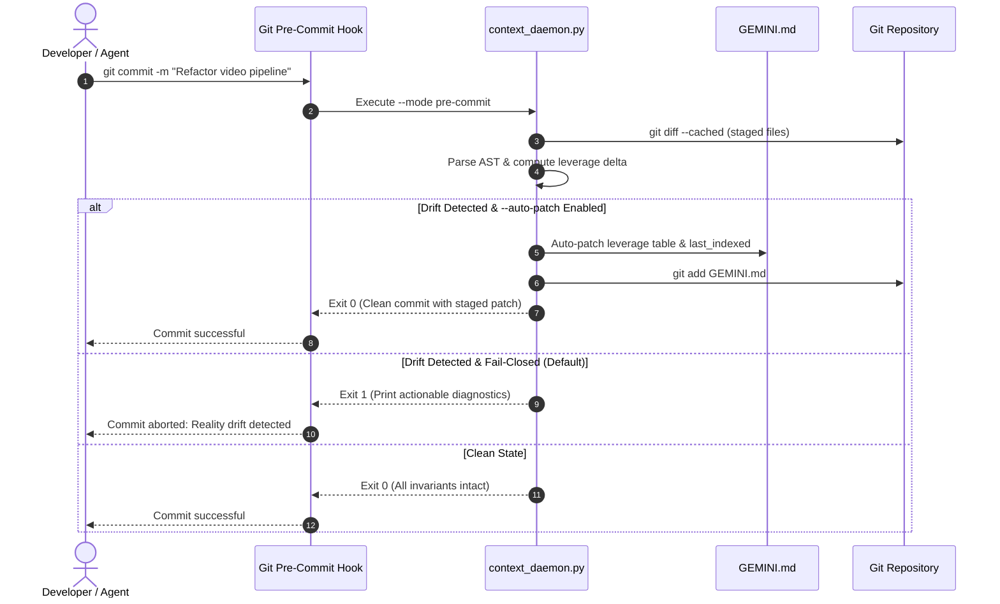

# VCS AST Delta Daemon & Continuous Reality Sync Guide

This guide details the motivation, architecture, differential AST algorithms, and operational workflows of the **VCS AST Delta Daemon** (`scripts/context_daemon.py`), introduced in `gemini-context-engineer` v4.0.0.

---

## 1. Motivation: The Passive Cache Dilemma & Documentation Sediment

In modern software development and agentic engineering environments, a workspace context file (`GEMINI.md`) functions as the cognitive foundation for autonomous coding agents. However, static documentation files suffer from a fundamental architectural vulnerability known as the **Passive Cache Dilemma**.

```text
                                  THE PASSIVE CACHE DILEMMA
┌──────────────────────────────────────┐             ┌──────────────────────────────────────┐
│        Active Codebase (VCS)         │             │      Passive Context (GEMINI.md)     │
├──────────────────────────────────────┤             ├──────────────────────────────────────┤
│ - Atomic commits every hour          │             │ - Static markdown on disk            │
│ - Refactored function signatures     │ ──DRIFT──►  │ - Outdated API parameters            │
│ - Renamed & deleted modules          │             │ - Orphaned components & dead links   │
│ - Leaky abstraction interface bloat  │             │ - Stale Ousterhout leverage metrics  │
└──────────────────────────────────────┘             └──────────────────────────────────────┘
                   ▲                                                    │
                   │               AGENT HALLUCINATION LOOP             │
                   └────────────────────────────────────────────────────┘
                     Agent reads stale GEMINI.md, writes code against
                     non-existent interfaces, causing build/test failures.
```

### 1.1 The Passive Cache Dilemma
When context documentation is treated as a passive artifact, it relies entirely on human discipline or post-hoc agent memory to remain accurate:
- **Asynchronous Evolution**: Code changes continuously through git commits, branch merges, and refactors. Documentation updates are routinely postponed ("I will update the docs in a later commit"), creating an expanding delta between code reality and documented context.
- **Silent Degradation**: Unlike code changes—which trigger compiler errors, linter diagnostics, or test failures when broken—stale documentation degrades silently. There is no native runtime exception when `GEMINI.md` references a deleted file or a mutated function signature.
- **Cognitive Poisoning**: For autonomous coding agents (Claude Code, Google Antigravity, OpenCode), stale context acts as cognitive poison. The agent trusts `GEMINI.md` as ground truth. When it encounters hallucinated entrypoints or obsolete signatures, it wastes token budgets and reasoning cycles attempting to reconcile contradictory signals.

### 1.2 Documentation Sediment
Over multiple sprints, untracked drift solidifies into **Documentation Sediment**:
1. **Orphaned Components**: Deleted or moved source files remain prominently listed in Section 2 (`## 🏗️ Architecture & Component Mapping`).
2. **Signature Drift**: Public function signatures or constructor arguments change in source files, while `GEMINI.md` examples remain obsolete.
3. **Leverage Erosion**: Modules that began as deep, high-leverage abstractions ($\text{leverage} \ge 8.0$) suffer interface bloat, degrading into shallow modules without being flagged.
4. **Phantom CLI Workflows**: Test flags, environment variables, or build targets documented in Section 4 are deprecated or removed from manifests.

### 1.3 The Solution: VCS Continuous Reality Enforcement
The VCS AST Delta Daemon eliminates documentation sediment by shifting context synchronization from an optional after-the-fact recommendation into an **active, non-bypassable VCS gatekeeper**:
- **Pre-Commit Gate**: Intercepts `git commit` operations, analyzes staged files with AST precision, and verifies alignment against `GEMINI.md` in $<100\text{ms}$.
- **Continuous Integration (CI)**: Runs in pull request pipelines to reject branches exhibiting architectural reality drift.
- **Deterministic Auto-Patching**: Safely heals mechanical discrepancies (timestamps, leverage metrics, component tables) without requiring human intervention.

---

## 2. AST Differential Detection Mechanism

The daemon does not perform crude textual keyword diffing. Instead, it leverages Python's standard library `ast` module and Git's low-level plumbing commands (`git diff --cached`, `git status --porcelain`) to perform **Abstract Syntax Tree (AST) Differential Detection**.

```text
Staged Changes (git diff --cached)
                │
                ▼
┌────────────────────────────────────────────────────────┐
│               AST Differential Analyzer                │
├──────────────────────────┬─────────────────────────────┤
│ 1. Breaking Signatures   │ - Public function & class   │
│                          │   parameter mutations       │
├──────────────────────────┼─────────────────────────────┤
│ 2. Leverage Shifts       │ - Delta LOC / Interfaces    │
│                          │ - Deep -> Shallow collapse  │
├──────────────────────────┼─────────────────────────────┤
│ 3. Entrypoint Integrity  │ - Deleted or renamed files  │
│                          │ - Orphaned table entries    │
└──────────────────────────┴─────────────────────────────┘
                │
                ▼
      Diagnostic Evaluation
    ┌───────────┴───────────┐
 Clean / Patched          Drift Detected
    │                       │
    ▼                       ▼
 Exit 0 (Commit OK)       Exit 1 (Commit Blocked)
```

### 2.1 Breaking Public Signatures
The daemon extracts the public symbol interface of all staged files and compares them with their pre-staged state:
- **Tracked Nodes**: `ast.FunctionDef`, `ast.AsyncFunctionDef`, and `ast.ClassDef` declarations that do not begin with an underscore `_`.
- **Interface Mutations**:
  - Addition of mandatory (non-default) positional or keyword-only arguments.
  - Removal or renaming of public functions/methods.
  - Modification of function return type annotations in typed codebases.
- **Cross-Validation**: If a modified public interface belongs to a component explicitly mapped in `GEMINI.md` Section 2, the daemon requires corresponding context synchronization or emits `ERR_SIGNATURE_DRIFT`.

### 2.2 Leverage Shifts (Ousterhout / Pocock Leverage Analysis)
John Ousterhout's *Philosophy of Software Design* defines a deep module as one that provides powerful functionality behind a simple interface:

$$\text{Leverage} = \frac{\text{Implementation LOC}}{\max(1, \text{Interface Count})}$$

| Classification | Leverage Threshold | Architectural Interpretation |
| :--- | :--- | :--- |
| **Deep Module** | $\text{Leverage} \ge 8.0$ | High power behind a compact interface; ideal abstraction. |
| **Moderate Module** | $2.5 \le \text{Leverage} < 8.0$ | Balanced implementation; standard component. |
| **Shallow Module** | $\text{Leverage} < 2.5$ | Leaky abstraction; complex interface relative to implementation. |

The AST daemon recalculates leverage for all staged and tracked modules:
1. **Leverage Collapse (`ERR_LEVERAGE_COLLAPSE`)**: Triggered if a module previously classified as Deep ($\ge 8.0$) drops below threshold into Moderate or Shallow territory due to interface proliferation or implementation stripping.
2. **Leverage Drift (`WARN_LEVERAGE_DRIFT`)**: Triggered if a module's leverage shifts by more than $\pm 20\%$ relative to the values recorded in the `GEMINI.md` Section 2 leverage table.

### 2.3 Deleted Entrypoints & Orphaned Components
When files are deleted or renamed via `git rm` or `git mv`:
- The daemon cross-references the list of deleted paths against all file links and component citations in `GEMINI.md`.
- If a deleted path remains documented in Section 2 (`## 🏗️ Architecture & Component Mapping`) or Section 4 (`## 🛠️ Common Workflows & CLI Commands`), the daemon flags an immediate `ERR_DELETED_ENTRYPOINT`.
- In strict mode, commits are rejected until the orphaned reference is excised.

---

## 3. Git Hook Installation & CI/CD Integration

The daemon operates across two primary enforcement surfaces: local Git hooks (developer machine) and automated CI workflows (remote pull request checks).



### 3.1 One-Step Hook Installation (`--install-hooks`)
Installing the pre-commit hook requires a single CLI command:

```powershell
python .agents/skills/gemini-context-engineer/scripts/context_daemon.py --install-hooks
```

This automates:
1. Locating the `.git/hooks` directory.
2. Generating a cross-platform executable hook script (`.git/hooks/pre-commit`).
3. Applying POSIX executable permissions (`chmod +x`) on Linux/macOS or creating equivalent Windows Git Bash / PowerShell shims.

#### Generated Hook Script (`.git/hooks/pre-commit`)
```bash
#!/usr/bin/env bash
# Gemini Context Engineer - VCS AST Delta Pre-Commit Gate
set -e

python .agents/skills/gemini-context-engineer/scripts/context_daemon.py --mode pre-commit --auto-patch
```

> [!TIP]
> **Husky Integration**: For repositories using Husky, add the following to `.husky/pre-commit`:
> ```bash
> python .agents/skills/gemini-context-engineer/scripts/context_daemon.py --mode pre-commit --auto-patch
> ```

### 3.2 Pre-Commit Mode (`--mode pre-commit`)
- **Latency Budget**: Executes in $<100\text{ms}$ by analyzing only staged files via `git diff --cached --name-only --diff-filter=ACMRD`.
- **Targeted Slicing**: Bypasses full repository scans, evaluating only staged `.py`, `.ts`, `.js`, and `.go` files.
- **Fail-Safe Fallback**: If Git is not installed or the directory is not a Git repository, the daemon safely falls back to standard filesystem inspection.

### 3.3 CI/CD Integration (`--ci`)
In remote CI pipelines, the daemon ensures that no pull request introducing architectural reality drift is merged to the mainline.

#### GitHub Actions Workflow (`.github/workflows/context-guard.yml`)
```yaml
name: Context Reality Guard

on:
  pull_request:
    branches: [ main, master ]
  push:
    branches: [ main, master ]

jobs:
  validate-context:
    runs-on: ubuntu-latest
    steps:
      - name: Check out repository
        uses: actions/checkout@v4
        with:
          fetch-depth: 0

      - name: Set up Python
        uses: actions/setup-python@v5
        with:
          python-version: '3.11'

      - name: Run VCS Context Reality Daemon (CI Mode)
        run: |
          python .agents/skills/gemini-context-engineer/scripts/context_daemon.py --ci --strict
```

---

## 4. Fail-Closed vs. Auto-Patch Behavior

The daemon supports two distinct operational modes: **Fail-Closed** (enforcing absolute human/agent oversight) and **Auto-Patch** (enabling frictionless deterministic updates).

```text
                                DECISION MATRIX
┌──────────────────────────────────────────────┬─────────────┬────────────┐
│ Event / Discrepancy Type                     │ Fail-Closed │ Auto-Patch │
├──────────────────────────────────────────────┼─────────────┼────────────┤
│ Timestamp Drift (last_indexed out of date)   │ Exit 1      │ Auto-Update│
│ Leverage Metric Shift (within same category) │ Exit 1      │ Auto-Update│
│ Module LOC / Interface Count delta           │ Exit 1      │ Auto-Update│
│ Minor Component Rename (1-to-1 match)        │ Exit 1      │ Auto-Update│
│ Deep Module Leverage Collapse (>=8.0 -> <2.5)│ Exit 1      │ Exit 1     │
│ Public Signature Mutation in Deep Module     │ Exit 1      │ Exit 1     │
│ Primary Architecture Entrypoint Deletion     │ Exit 1      │ Exit 1     │
│ Frontmatter Schema Corruption                │ Exit 1      │ Exit 1     │
└──────────────────────────────────────────────┴─────────────┴────────────┘
```

### 4.1 Fail-Closed Protocol (Default & CI Mode)
Under Fail-Closed execution, any detected drift halts the commit or fails the CI build:
- **Exit Code**: Returns `1`.
- **Diagnostics**: Outputs a structured terminal diagnostic payload listing exact violations:

```text
[CONTEXT DAEMON] Reality Drift Detected!
  - ERR_DELETED_ENTRYPOINT: Staged deletion of 'timeline_engine.py' leaves orphaned entry in GEMINI.md (line 42).
  - ERR_LEVERAGE_COLLAPSE: 'compile_video.py' leverage dropped from 61.5 to 1.8 (Deep -> Shallow).
  - WARN_STALE_TIMESTAMP: Frontmatter 'last_indexed' is 2026-08-15 (expected 2026-09-03).

Commit aborted. Run with --auto-patch or manually update GEMINI.md.
```

### 4.2 Auto-Patch Protocol (`--auto-patch`)
When invoked with `--auto-patch`, the daemon deterministically resolves safe mechanical discrepancies:
1. **Frontmatter Synchronization**: Updates `last_indexed` in YAML frontmatter to the current ISO date (`YYYY-MM-DD`).
2. **Leverage Table Refresh**: Re-computes AST metrics for staged components and updates the Section 2 `### Architectural Health & Deep Modules` markdown table with refreshed Interface Counts, LOC, and Leverage values.
3. **Component Table Pruning**: Removes rows for deleted files if confirmed by `git status`.
4. **Git Staging**: Automatically runs `git add GEMINI.md` so the patched context file is included in the current commit without breaking the developer's flow.
5. **Safety Guardrail**: If an invariant violation occurs that requires an architectural design decision (such as a deep module collapsing or a primary entrypoint being deleted), the daemon **refuses to auto-patch** and falls back to failing closed.

---

## 5. CLI Usage & Flags Reference

```text
python <SKILL_DIR>/scripts/context_daemon.py [OPTIONS]
```

### 5.1 Options Reference Table

| Option | Type | Default | Description |
| :--- | :--- | :--- | :--- |
| `--root <path>` | Path | `.` | Root directory of the repository containing `GEMINI.md`. |
| `--mode <mode>` | Choice | `pre-commit` | Execution mode: `pre-commit`, `ci`, or `daemon` (polling loop). |
| `--auto-patch` | Flag | `False` | Automatically patches deterministic discrepancies and stages `GEMINI.md`. |
| `--install-hooks` | Flag | `False` | Installs the pre-commit hook into `.git/hooks/pre-commit` and exits. |
| `--ci` | Flag | `False` | Convenience alias for `--mode ci --strict`. Compares against `origin/main`. |
| `--strict` | Flag | `False` | Treats warnings as fatal errors; forbids auto-patch on leverage collapse. |
| `--json` | Flag | `False` | Outputs structured JSON diagnostic telemetry to stdout. |

### 5.2 Command Examples

#### Example 1: Install Git Pre-Commit Hook
```powershell
python .agents/skills/gemini-context-engineer/scripts/context_daemon.py --install-hooks
```

#### Example 2: Manual Pre-Commit Verification (Dry Run)
```powershell
python .agents/skills/gemini-context-engineer/scripts/context_daemon.py --mode pre-commit
```

#### Example 3: Pre-Commit with Auto-Patching
```powershell
python .agents/skills/gemini-context-engineer/scripts/context_daemon.py --mode pre-commit --auto-patch
```

#### Example 4: CI Pipeline Pull Request Gate
```bash
python .agents/skills/gemini-context-engineer/scripts/context_daemon.py --ci --strict
```

#### Example 5: Structured JSON Output for Tooling Integration
```powershell
python .agents/skills/gemini-context-engineer/scripts/context_daemon.py --mode pre-commit --json
```

**Sample JSON Output**:
```json
{
  "status": "drift_detected",
  "exit_code": 1,
  "mode": "pre-commit",
  "timestamp": "2026-09-03T12:00:00Z",
  "staged_files": ["compile_video.py", "timeline_engine.py"],
  "violations": [
    {
      "code": "ERR_SIGNATURE_DRIFT",
      "file": "timeline_engine.py",
      "message": "Public method 'sync_timeline' added non-default parameter 'enforce_monotonic'."
    },
    {
      "code": "WARN_LEVERAGE_DRIFT",
      "file": "compile_video.py",
      "message": "Leverage changed from 61.5 to 54.2 (-11.8%)."
    }
  ],
  "patched": false
}
```

---

## 6. Best Practices

1. **Always Install Hooks on Onboarding**: Run `--install-hooks` immediately after cloning or setting up a repository to prevent documentation sediment from the first commit.
2. **Pair with Auto-Patch in Local Dev**: Use `--auto-patch` locally so routine code improvements automatically keep leverage tables and timestamps synchronized without manual friction.
3. **Enforce Strict Mode in CI**: In CI workflows, always specify `--ci --strict` to ensure that breaking signature changes and deleted entrypoints receive explicit architectural review.
4. **Never Auto-Patch Destructive Changes**: If the daemon fails closed on a deleted primary entrypoint or collapsed deep module, pause and update the architecture mapping intentionally—do not bypass the gate with `git commit --no-verify`.
