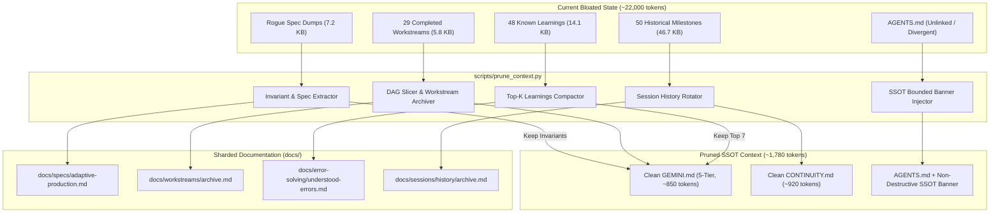

# Context Decomposition, Automated Sharding & Cross-Agent Federation Plan

> **For agentic workers:** REQUIRED SUB-SKILL: Use `superpowers:subagent-driven-development` (recommended) or `superpowers:executing-plans` to implement this plan task-by-task. Steps use checkbox (`- [ ]`) syntax for tracking.

**Goal:** Implement automated, deterministic context sharding and non-destructive cross-agent federation in `gemini-context-engineer` to eliminate token bloat in `GEMINI.md` and `CONTINUITY.md` (sharding long sections to `docs/` while preserving safety rules and invariants) and establish `GEMINI.md` as the authoritative SSOT across both `CLAUDE.md` (used by Claude CLI & Claude Code Desktop) and `AGENTS.md` (used by OpenCode, Codex, Aider, and polyglot AI agents), keeping `GEMINI.md` as the canonical authority for Google Antigravity 2.0, CLI, and IDE without destroying satellite configurations.

**Architecture:** A dedicated, zero-dependency Python deep module `scripts/prune_context.py` parses and compacts bloated `GEMINI.md` and `CONTINUITY.md` files, relocating spec dumps, completed workstreams, and surplus failure modes into structured `docs/` archives with single-line GitHub-flavored alert pointers. Non-destructive federation in `repo_indexer.py` and `validate_gemini_md.py` injects bounded, idempotent authoritative SSOT directives into `CLAUDE.md` and `AGENTS.md` (as well as `.cursorrules`), establishing clear precedence while preserving bespoke agent configs, permissions, and tool definitions.

**Tech Stack:** Python 3.11+ (standard library only: `re`, `pathlib`, `json`, `argparse`, `tempfile`, `shutil`), PowerShell 7+, Bash, GitHub Actions CI.

**Spec / Baseline Inputs:**
- Sample bloated `GEMINI.md`: `C:\Users\Snoozer\Downloads\GEMINI.md` (236 lines, 37,619 bytes, ~9,404 tokens)
- Sample bloated `CONTINUITY.md`: `C:\Users\Snoozer\Downloads\CONTINUITY.md` (334 lines, 50,262 bytes, ~12,565 tokens)
- Ecosystem role split: `GEMINI.md` (Google Antigravity 2.0 / CLI / IDE), `CLAUDE.md` (Claude CLI / Claude Code Desktop), `AGENTS.md` (OpenCode / Codex / Aider / other AI agents), `.cursorrules` (Cursor IDE)
- Target budget: $\le 350$ lines, $\le 2,500$ estimated tokens ($\text{chars} // 4$)

---

## Global Constraints

- **Stdlib-Only**: All scripts must use Python standard library only. Zero third-party `pip` packages.
- **5-Tier Anatomy Invariant**: `GEMINI.md` must strictly maintain exactly 5 H2 headers (`🎯`, `🏗️`, `🛑`, `🛠️`, `🔄`) and single H1.
- **Zero Loss of Safety Rules**: Permanent engineering constraints, anti-sycophancy directives, and runtime invariants must never be purged from `GEMINI.md`.
- **Zero Destruction of Agent Configs**: Neither `CLAUDE.md` nor `AGENTS.md` (nor `.cursorrules`) must ever be unlinked or wiped; the SSOT directive must be non-destructively injected with user content preserved intact.
- **Atomic Operations**: File writes must use `NamedTemporaryFile` + `os.replace` + `fsync` with up to 3 rotating `.bak` generations.
- **Cross-Platform Resilient**: Windows PowerShell & POSIX Bash compatibility with explicit UTF-8 encoding streams.

---

## 1. Forensic Analysis & Highly Opinionated Design

### What Went Wrong in the Sample Files?

1. **`GEMINI.md` Bloat (9,404 tokens vs 2,500 budget)**:
   - **Rogue H2 Specification**: A 20-line, 7,162-byte unsectioned contract (`## Adaptive multi-channel production: current opt-in contract`) was dumped into the file, violating the 5-Tier anatomy.
   - **29 Completed Workstreams**: Section 5 retained all historical workstreams `#1` through `#30` marked `Done` with extensive proof narratives (5,753 bytes).
   - **48 Learning Entries**: `### Known Failure Modes & Project Learnings` accumulated 54 lines and 14,083 bytes (~3,504 tokens)—exceeding the hard token budget of the entire file on its own!

2. **`CONTINUITY.md` Bloat (12,565 tokens vs ~1,000 budget)**:
   - 92.9% of the file (305 lines, 46,606 bytes) was dead historical archive (`- Historical Archive:`) listing 50 past milestones, including duplicated nested session states.

3. **`AGENTS.md` Federation Defect**:
   - The existing `--federate` flag in `repo_indexer.py` and `validate_gemini_md.py` calls `fpath.unlink()` and replaces `AGENTS.md` with an OS symlink or a generic 3-line pointer shim. In repositories with customized `AGENTS.md` files (like OpenCode orchestrator configs or custom tool definitions), this permanently destroys all user configuration!



---

## 2. Proposed Changes by Component

Grouped by component, ordered dependencies first.

---

### Component A: Core Context Pruner (`scripts/prune_context.py`)

#### [NEW] `.agents/skills/gemini-context-engineer/scripts/prune_context.py`
A high-leverage standalone deep module that:
1. Calculates line count, character count, and estimated tokens ($\lfloor \text{chars} / 4 \rfloor$).
2. Shards rogue/non-canonical H2 sections to `docs/specs/<slug>.md`, extracting any permanent invariants (`MUST`, `NEVER`, `ALWAYS`) into Section 3.
3. Archives completed workstreams (`Status == Done`) to `docs/workstreams/archive.md`, leaving active tasks and a clean alert pointer.
4. Archives excess failure modes to `docs/error-solving/understood-errors.md`, keeping the top $K$ (default: 7) high-frequency negative constraints in Section 5.
5. Compacts `CONTINUITY.md` by moving `- Historical Archive:` milestones to `docs/sessions/history/archive.md`.
6. Prints a before/after metrics table showing line count, byte size, token count, and percentage reduction.

```python
# Key CLI flags:
# python scripts/prune_context.py --file GEMINI.md [--dry-run] [--apply] [--keep-learnings 7]
# python scripts/prune_context.py --file CONTINUITY.md [--dry-run] [--apply]
# python scripts/prune_context.py --all [--dry-run] [--apply]
```

---

### Component B: Non-Destructive Cross-Agent Federation

#### [MODIFY] `.agents/skills/gemini-context-engineer/scripts/repo_indexer.py`
- Replace lines 251–280.
- Implement `classify_federation_file(fpath)` to distinguish `missing`, `symlink`, `pointer_shim`, `federated_hybrid`, and `divergent`.
- Implement `inject_or_update_federation(fpath, fname)` to non-destructively insert or update the bounded SSOT banner:
```markdown
<!-- AGENT-SYNC: GEMINI.md:start -->
<!-- AGENT-SYNC: GEMINI.md -->
> [!IMPORTANT]
> **AUTHORITATIVE CONTEXT DIRECTIVE**:
> Read [GEMINI.md](./GEMINI.md) now and use it as the current project guidance where it differs from {target_filename}.
> `GEMINI.md` is the canonical Single Source of Truth (SSOT) for this repository's architecture, engineering constraints, workflows, and standards.
> All rules, commands, and workstream states defined in `GEMINI.md` supersede any conflicting instructions below.
<!-- AGENT-SYNC: GEMINI.md:end -->
```
- Preserve all existing user content below the banner.

#### [MODIFY] `.agents/skills/gemini-context-engineer/scripts/validate_gemini_md.py`
- Replace lines 362–402.
- Use `classify_federation_file` so `federated_hybrid` files are recognized as validly aligned (no `WARN_SPLIT_BRAIN_CONTEXT`).
- Under `--federate`, call `inject_or_update_federation` rather than deleting/wiping files.
- Support tracking `.cursorrules` in addition to `CLAUDE.md` and `AGENTS.md`.

---

### Component C: Skill Documentation & Reference Guides

#### [MODIFY] `.agents/skills/gemini-context-engineer/SKILL.md`
- Add **Protocol 10: PRUNE / SHARD (Context Density Pruning & Spec Extraction)** to Section 1.
- Document `scripts/prune_context.py` in Section 6 (Zero-Dependency Script Reference).
- Update Section 1 Protocol 6 (Cross-Ecosystem Federation) to describe non-destructive SSOT banner injection.

#### [MODIFY] `.agents/skills/gemini-context-engineer/references/cross_ecosystem_federation.md`
- Update Mechanism B from "Standardized Pointer Shims" to "Non-Destructive Authoritative Directive Injection (Hybrid Shims)".
- Document the authoritative precedence rule and bounded delimiter format.

#### [MODIFY] `.agents/skills/gemini-context-engineer/references/token_budget_heuristics.md`
- Document the sharding taxonomy: rogue specs $\to$ `docs/specs/`, completed workstreams $\to$ `docs/workstreams/archive.md`, historical learnings $\to$ `docs/error-solving/understood-errors.md`, continuity archives $\to$ `docs/sessions/history/archive.md`.

---

### Component D: Test Suite & Pressure Scenarios

#### [NEW] `.agents/skills/gemini-context-engineer/tests/test_prune_context.py`
Unit tests for `prune_context.py`:
- `test_prune_gemini_rogue_h2_extraction`: Verifies rogue H2 is moved to `docs/specs/` and invariants added to Section 3.
- `test_prune_gemini_completed_workstreams`: Verifies `Done` rows are archived to `docs/workstreams/archive.md`.
- `test_prune_gemini_learnings_compaction`: Verifies excess learnings are archived to `docs/error-solving/`.
- `test_prune_continuity_historical_archive`: Verifies `- Historical Archive:` is moved to `docs/sessions/history/`.
- `test_dry_run_non_mutating`: Verifies `--dry-run` does not touch disk files.
- `test_atomic_backup_rotation`: Verifies max 3 `.bak` files are maintained.

#### [MODIFY] `.agents/skills/gemini-context-engineer/tests/test_indexer.py`
- Add test verifying that an existing `AGENTS.md` with substantive content retains its content when `--federate` runs.

#### [MODIFY] `.agents/skills/gemini-context-engineer/tests/test_validator.py`
- Add test verifying that `federated_hybrid` files pass validation without split-brain warnings.

#### [NEW] `tests/test_context_pruning_pressure.py` (Repo-level)
- Runs `prune_context.py` directly against the user's sample files:
  - `C:\Users\Snoozer\Downloads\GEMINI.md`
  - `C:\Users\Snoozer\Downloads\CONTINUITY.md`
- Asserts that pruned files pass `validate_gemini_md.py --strict` with exit code 0 and line count $\le 350$.

---

## 3. Step-by-Step Implementation Tasks

### Task 1: Non-Destructive Cross-Agent Federation Engine

**Files:**
- Modify: `.agents/skills/gemini-context-engineer/scripts/repo_indexer.py:251-285`
- Modify: `.agents/skills/gemini-context-engineer/scripts/validate_gemini_md.py:362-405`
- Test: `.agents/skills/gemini-context-engineer/tests/test_indexer.py`
- Test: `.agents/skills/gemini-context-engineer/tests/test_validator.py`

**Interfaces:**
- `classify_federation_file(fpath: Path) -> tuple[str, str]`
- `inject_or_update_federation(fpath: Path, target_filename: str) -> str`

- [ ] **Step 1: Write failing tests in `test_indexer.py` and `test_validator.py`**
  Assert that when `AGENTS.md` has custom content `## Custom Tooling Instructions`, running with `--federate` preserves the custom content, injects the banner, and does not emit `WARN_SPLIT_BRAIN_CONTEXT`.
- [ ] **Step 2: Run tests to verify failure**
  Run: `python -m unittest .agents/skills/gemini-context-engineer/tests/test_indexer.py`
- [ ] **Step 3: Implement `classify_federation_file` and `inject_or_update_federation` in both scripts**
- [ ] **Step 4: Run tests to verify they pass**
  Run: `python -m unittest .agents/skills/gemini-context-engineer/tests/test_indexer.py .agents/skills/gemini-context-engineer/tests/test_validator.py`
- [ ] **Step 5: Run existing benchmark `run_evals.py` to confirm zero regressions**
  Run: `python .agents/skills/gemini-context-engineer/scripts/run_evals.py` (eval-2 must PASS).

---

### Task 2: Context Decomposition & Sharding Engine (`scripts/prune_context.py`)

**Files:**
- Create: `.agents/skills/gemini-context-engineer/scripts/prune_context.py`
- Create: `.agents/skills/gemini-context-engineer/tests/test_prune_context.py`

**Interfaces:**
- `prune_gemini_md(content: str, repo_root: Path, keep_learnings: int = 7) -> tuple[str, dict]`
- `prune_continuity_md(content: str, repo_root: Path) -> tuple[str, dict]`
- `format_metrics_table(stats_before: dict, stats_after: dict, file_label: str) -> str`

- [ ] **Step 1: Write failing unit tests in `test_prune_context.py`**
  Cover rogue H2 extraction, workstream archiving, learnings compaction, continuity archiving, and before/after metrics output.
- [ ] **Step 2: Run test to verify failure**
  Run: `python -m unittest .agents/skills/gemini-context-engineer/tests/test_prune_context.py`
- [ ] **Step 3: Implement `scripts/prune_context.py`**
  - Section parser recognizing the 5 canonical H2s vs rogue H2s.
  - Spec sharder writing to `docs/specs/<slug>.md`.
  - Section 3 invariant extractor.
  - Section 5 workstream archiver to `docs/workstreams/archive.md`.
  - Learnings archiver to `docs/error-solving/understood-errors.md`.
  - Continuity archiver to `docs/sessions/history/archive.md`.
  - Terminal metrics table renderer showing lines before/after, bytes before/after, estimated tokens before/after, and percentage savings.
- [ ] **Step 4: Run tests to verify pass**
  Run: `python -m unittest .agents/skills/gemini-context-engineer/tests/test_prune_context.py`

---

### Task 3: Pressure Testing Against User Sample Files

**Files:**
- Create: `tests/test_context_pruning_pressure.py`

- [ ] **Step 1: Write pressure test loading `C:\Users\Snoozer\Downloads\GEMINI.md` and `C:\Users\Snoozer\Downloads\CONTINUITY.md`**
- [ ] **Step 2: Execute pruning in a temporary workspace fixture**
- [ ] **Step 3: Assert pruned `GEMINI.md` satisfies:**
  - Exactly 5 H2 headers
  - Line count $\le 160$ lines (down from 236 lines)
  - Estimated tokens $\le 1,200$ tokens (down from 9,404 tokens)
  - Passes `validate_gemini_md.py --strict --reality` with exit code 0
  - Invariants preserved in Section 3
- [ ] **Step 4: Assert pruned `CONTINUITY.md` satisfies:**
  - Canonical schema preserved (Goal, Constraints, Key decisions, State)
  - Line count $\le 40$ lines (down from 334 lines)
  - Estimated tokens $\le 1,000$ tokens (down from 12,565 tokens)
  - Historical archive cleanly relocated to `docs/sessions/history/archive.md`
- [ ] **Step 5: Run pressure test**
  Run: `python -m unittest tests/test_context_pruning_pressure.py`

---

### Task 4: Skill Specification & Reference Documentation Sync

**Files:**
- Modify: `.agents/skills/gemini-context-engineer/SKILL.md`
- Modify: `.agents/skills/gemini-context-engineer/references/token_budget_heuristics.md`
- Modify: `.agents/skills/gemini-context-engineer/references/cross_ecosystem_federation.md`
- Modify: `scripts/manifest.py` (if new script exposed)
- Run: `python scripts/compile_adapters.py`
- Run: `install.ps1 -Force`

- [ ] **Step 1: Update `SKILL.md` with Protocol 10: PRUNE / SHARD and updated script references**
- [ ] **Step 2: Update reference guides with sharding taxonomy and non-destructive federation**
- [ ] **Step 3: Run `python scripts/validate.py` to ensure all skills pass CI validation**
- [ ] **Step 4: Compile adapters and synchronize installed host targets**
  Run: `python scripts/manifest.py && python scripts/compile_adapters.py && powershell -File install.ps1 -Force`

---

## Verification Plan

### Automated Tests
1. **Skill Validator CI Gate**:
   ```powershell
   python scripts/validate.py
   ```
   *Expected*: `PASS: .agents\skills\gemini-context-engineer` (0 errors, 0 warnings).

2. **Skill Unit Tests & Evals**:
   ```powershell
   python -m unittest discover .agents/skills/gemini-context-engineer/tests
   python .agents/skills/gemini-context-engineer/scripts/run_evals.py
   ```
   *Expected*: 44+ tests passing, 7/7 benchmark evals PASS (including `eval-2-federation-repair`).

3. **Pressure Test against User's Download Files**:
   ```powershell
   python -m unittest tests/test_context_pruning_pressure.py -v
   ```
   *Expected*: Both `C:\Users\Snoozer\Downloads\GEMINI.md` and `C:\Users\Snoozer\Downloads\CONTINUITY.md` pruned and validated with 0 errors and >85% token reduction.

4. **Full Workspace Regression**:
   ```powershell
   python tests/test_skill_isolation_and_portability.py
   python tests/test_release_sync_pressure.py -v
   ```

### Manual Verification
1. Run `python .agents/skills/gemini-context-engineer/scripts/prune_context.py --file C:\Users\Snoozer\Downloads\GEMINI.md --dry-run` and review the printed before/after metrics table in the console.
2. Inspect the sharded files created under `docs/specs/`, `docs/workstreams/`, `docs/error-solving/`, and `docs/sessions/history/` to confirm exact pointer links and zero data loss.
3. Inspect `AGENTS.md` to confirm the authoritative SSOT directive is clearly displayed at the top while preserving all underlying instructions.
